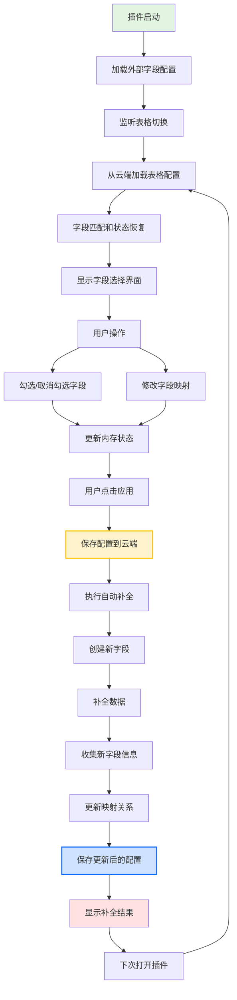

# 字段配置加载和保存流程文档

## 概述

本文档描述了飞书多维表格插件中字段配置的完整加载和保存流程，包括从外部多维表格加载配置、用户操作、云端保存以及补全后的自动映射更新。

## 系统架构

### 核心组件
- **FieldAutoComplete.tsx**: 主界面组件，处理字段选择和配置管理
- **fieldsConfigService.ts**: 字段配置服务，负责从外部多维表格加载配置
- **autoCompleteHelper.ts**: 自动补全核心逻辑，处理字段创建和数据补全
- **FieldSelection.tsx**: 字段选择UI组件

### 数据存储
- **外部多维表格**: 存储字段配置的主数据源
- **多维表格云存储**: 使用 `bitable.bridge.setData/getData` 存储表格级别的配置

## 详细流程

### 1. 插件初始化阶段

#### 1.1 字段配置加载
```typescript
// FieldAutoComplete.tsx
const { data: fieldsConfigData, isLoading: fieldsConfigLoading, error: fieldsConfigError } = useQuery({
  queryKey: ['fieldsConfig'],
  queryFn: getFieldsConfig,
  staleTime: 5 * 60 * 1000, // 5分钟内不会重新请求
  gcTime: 10 * 60 * 1000, // 10分钟后垃圾回收
  retry: 2, // 失败重试2次
});
```

**流程说明**:
1. 使用 React Query 从外部多维表格加载字段配置
2. 通过 `fieldsConfigService.ts` 调用后端服务获取配置
3. 如果后端服务失败，使用默认配置作为 fallback
4. 配置数据包含字段名称、映射关系、类型等信息

#### 1.2 表格切换监听
```typescript
// 监听表格切换事件
const handleSelectionChange = async () => {
  const table = await bitable.base.getActiveTable();
  const tableName = await table.getName();
  const tableId = `table_${tableName}`.replace(/[^a-zA-Z0-9_]/g, '_');
  
  // 设置当前表格信息
  setTableName(name);
  setCurrentTable(table);
  setCurrentTableId(tableId);
};
```

**流程说明**:
1. 监听多维表格的选择变化事件
2. 获取当前活动表格的基本信息
3. 生成唯一的表格ID用于配置存储

### 2. 字段匹配和配置恢复

#### 2.1 字段匹配逻辑
```typescript
const matchExistingFields = async (fieldsToMatch: Field[], currentTableInstance: any) => {
  // 1. 获取表格ID和当前表格字段
  const tableName = await currentTableInstance.getName();
  const tableId = `table_${tableName}`.replace(/[^a-zA-Z0-9_]/g, '_');
  const currentTableFields = await getTableFields(currentTableInstance);
  
  // 2. 从云端加载保存的配置
  const savedConfig = await loadTableFieldConfig(tableId);
  
  // 3. 匹配字段并恢复配置
  return fieldsToMatch.map(field => {
    const savedFieldConfig = savedConfig?.fieldConfigs.find(fc => fc.fieldId === field.id);
    
    if (savedFieldConfig) {
      // 使用保存的配置（包括勾选状态）
      return {
        ...field,
        isChecked: savedFieldConfig.isChecked,
        targetFieldId: savedFieldConfig.targetFieldId,
        targetFieldName: savedFieldConfig.targetFieldName,
        mappingType: savedFieldConfig.mappingType
      };
    } else {
      // 使用名称匹配逻辑
      const existingField = fieldNameMap.get(field.name);
      return {
        ...field,
        isChecked: existingField ? true : field.isChecked,
        mappingType: existingField ? 'existing' : 'new'
      };
    }
  });
};
```

**流程说明**:
1. **优先级1**: 从云端加载保存的配置，恢复勾选状态和映射关系
2. **优先级2**: 如果没有保存配置，使用字段名称匹配现有表格字段
3. **优先级3**: 新字段保持默认状态，标记为需要新建

#### 2.2 配置恢复特点
- ✅ **保持勾选状态**: 包括需要新建字段的勾选状态
- ✅ **映射关系恢复**: 已映射的字段保持映射关系
- ✅ **智能降级**: 如果目标字段不存在，自动调整为新建模式

### 3. 用户操作阶段

#### 3.1 字段选择处理
```typescript
const handleFieldChange = useCallback((id: string, checked: boolean) => {
  setFields(prev => prev.map(field => {
    if (field.id === id) {
      const updatedField = { ...field, isChecked: checked };
      
      // 智能设置映射类型
      if (checked && !field.targetFieldId) {
        updatedField.mappingType = 'new';
      }
      
      return updatedField;
    }
    return field;
  }));
}, []);
```

**流程说明**:
1. 用户勾选/取消勾选字段时，仅更新内存中的状态
2. 不会触发云端保存，避免频繁的网络请求
3. 智能设置映射类型（新建字段默认为 'new'）

#### 3.2 字段映射处理
```typescript
const handleFieldMappingChange = useCallback((
  fieldId: string,
  targetFieldId?: string,
  targetFieldName?: string,
  mappingType?: 'existing' | 'new'
) => {
  setFields(prev => prev.map(field =>
    field.id === fieldId
      ? { ...field, targetFieldId, targetFieldName, mappingType }
      : field
  ));
}, []);
```

**流程说明**:
1. 用户修改字段映射关系时，更新内存中的状态
2. 支持映射到现有字段或新建字段
3. 不触发云端保存，保持操作流畅性

### 4. 执行补全阶段

#### 4.1 配置保存时机
```typescript
const handleApply = async () => {
  // 获取选中的字段
  const selectedFields = fields.filter(f => f.isChecked);
  
  // 🔑 关键：在执行补全时保存完整的字段配置
  if (currentTableId && tableName) {
    console.log('[FieldAutoComplete] 保存表格配置，表格ID:', currentTableId);
    
    try {
      await saveTableFieldConfig(currentTableId, tableName, fields);
      console.log('[FieldAutoComplete] 配置保存成功，下次打开将恢复勾选状态');
    } catch (error) {
      console.error('[FieldAutoComplete] 配置保存失败，但继续执行补全:', error);
    }
  }
  
  // 执行自动补全
  await autoCompleteFields({...});
};
```

**流程说明**:
1. **唯一保存时机**: 只在用户点击"应用"按钮时保存配置
2. **完整配置保存**: 保存所有字段的勾选状态和映射关系
3. **容错处理**: 保存失败不影响补全操作

#### 4.2 云端保存实现
```typescript
const saveTableFieldConfig = async (tableId: string, tableName: string, fields: Field[]) => {
  const config: TableFieldConfig = {
    tableId,
    tableName,
    fieldConfigs: fields.map(field => ({
      fieldId: field.id,
      fieldName: field.name,
      isChecked: field.isChecked,  // 🔑 保存勾选状态
      targetFieldId: field.targetFieldId,
      targetFieldName: field.targetFieldName,
      mappingType: field.mappingType || 'new'
    })),
    lastUpdated: new Date().toISOString()
  };

  const configKey = getTableConfigKey(tableId);
  await bitable.bridge.setData(configKey, JSON.stringify(config));
};
```

**流程说明**:
1. 使用 `bitable.bridge.setData` 保存到多维表格云存储
2. 配置按表格维度存储，支持团队共享
3. 包含完整的字段状态信息

### 5. 补全完成后的自动映射更新

#### 5.1 新字段信息收集
```typescript
// autoCompleteHelper.ts
const newlyCreatedFieldsInfo: Array<{ 
  fieldId: string;      // 新创建的字段ID
  fieldName: string;    // 字段名称
  originalFieldId: string; // 原始配置中的字段ID
}> = [];

// 收集新创建的字段信息
for (const result of results) {
  if (result.success) {
    const fieldId = fieldNameToId[result.fieldName];
    if (fieldId) {
      const originalField = selectedFields.find(f => f.name === result.fieldName);
      if (originalField) {
        newlyCreatedFieldsInfo.push({
          fieldId: fieldId,
          fieldName: result.fieldName,
          originalFieldId: originalField.id
        });
      }
    }
  }
}
```

#### 5.2 映射关系自动更新
```typescript
// FieldAutoComplete.tsx
onComplete: async (result) => {
  setCompletionResult(result);
  setPageState('result');
  
  // 🔑 关键：处理新创建的字段，更新映射关系并保存配置
  if (result.newlyCreatedFields && result.newlyCreatedFields.length > 0) {
    console.log('[FieldAutoComplete] 检测到新创建的字段，开始更新映射关系');
    
    // 更新字段映射关系
    const updatedFields = fields.map(field => {
      const newlyCreated = result.newlyCreatedFields?.find(
        nf => nf.originalFieldId === field.id
      );
      
      if (newlyCreated) {
        console.log(`[FieldAutoComplete] 更新字段映射: ${field.name} -> ${newlyCreated.fieldId}`);
        return {
          ...field,
          targetFieldId: newlyCreated.fieldId,
          targetFieldName: newlyCreated.fieldName,
          mappingType: 'existing' as const // 从 'new' 改为 'existing'
        };
      }
      
      return field;
    });
    
    // 更新本地状态
    setFields(updatedFields);
    
    // 保存更新后的配置到云端
    if (currentTableId && tableName) {
      try {
        await saveTableFieldConfig(currentTableId, tableName, updatedFields);
        console.log('[FieldAutoComplete] 新字段映射关系已保存到云端');
        
        toast({
          title: "配置已更新",
          description: `${result.newlyCreatedFields.length} 个新字段的映射关系已更新并保存`,
          duration: 3000
        });
      } catch (error) {
        console.error('[FieldAutoComplete] 保存新字段映射失败:', error);
      }
    }
  }
}
```

**流程说明**:
1. **检测新字段**: 补全完成后检查是否有新创建的字段
2. **更新映射**: 将新字段的映射类型从 'new' 改为 'existing'
3. **保存配置**: 自动保存更新后的配置到云端
4. **用户反馈**: 显示更新成功的提示信息

## 数据流程图



## 关键特性

### 1. 智能配置管理
- **云端存储**: 使用多维表格云存储，支持团队共享
- **表格级别**: 每个表格有独立的配置
- **状态持久化**: 勾选状态和映射关系完全保存

### 2. 用户体验优化
- **实时操作**: 用户操作时无延迟，不等待云端响应
- **自动恢复**: 下次打开自动恢复上次的配置
- **智能映射**: 自动处理字段创建后的映射更新

### 3. 容错和降级
- **保存失败不影响补全**: 配置保存失败不会阻止补全操作
- **配置加载失败使用默认**: 外部配置加载失败时使用默认配置
- **字段不存在自动调整**: 目标字段不存在时自动调整为新建模式

### 4. 团队协作支持
- **配置共享**: 团队成员看到相同的字段配置
- **状态同步**: 所有用户的配置状态实时同步
- **版本管理**: 支持配置的版本控制和回滚

## 配置数据结构

### TableFieldConfig 接口
```typescript
export interface TableFieldConfig {
  tableId: string;           // 表格唯一标识
  tableName: string;         // 表格名称
  fieldConfigs: {            // 字段配置数组
    fieldId: string;         // 字段ID
    fieldName: string;       // 字段名称
    isChecked: boolean;      // 勾选状态
    targetFieldId?: string;  // 目标字段ID
    targetFieldName?: string; // 目标字段名称
    mappingType: 'existing' | 'new'; // 映射类型
  }[];
  lastUpdated: string;       // 最后更新时间
}
```

### Field 接口
```typescript
export interface Field {
  id: string;                // 字段ID
  name: string;              // 字段名称
  type: string;              // 字段类型
  isChecked: boolean;        // 勾选状态
  mapping_field: string;     // 映射字段名
  targetFieldId?: string;    // 目标字段ID
  targetFieldName?: string;  // 目标字段名称
  mappingType?: 'existing' | 'new'; // 映射类型
  hasWarning?: boolean;      // 警告状态
  warningMessage?: string;   // 警告信息
}
```

## 总结

这个字段配置系统实现了完整的生命周期管理：

1. **初始化**: 从外部加载配置，恢复用户状态
2. **操作**: 用户友好的界面操作，无延迟响应
3. **保存**: 智能的保存时机，确保数据不丢失
4. **更新**: 自动处理字段创建后的映射更新
5. **共享**: 团队级别的配置共享和同步

整个系统设计注重用户体验、数据一致性和团队协作，为多维表格插件提供了强大而灵活的字段配置管理能力。
